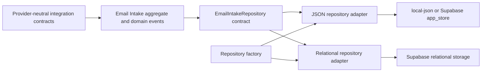

# SUPPER Architecture Consolidation

Patch B3.5 consolidates the provider-neutral B2/B3 foundation without starting a provider integration. It begins from Golden Source `supper-source-audit-3bcb4e9.zip` and source commit `3bcb4e93b68f3ee722b156c402ce7c981b7d5e6d`.

## Scope and invariants

B3.5 changes only module boundaries, duplicated pure validation primitives, internal error context, isolated tests, read-only verification scripts, and documentation. It does not change UI, API routes, authentication, sessions, Origin protection, ticket/customer/report behavior, persistence keys, table usage, backend selection, environment variables, SQL, migration ordering, or runtime assets.

The following remain explicitly out of scope: IMAP, POP3, SMTP, Outlook or Microsoft Graph, n8n, ServiceNow, AI, queues, workers, schedulers, webhooks, object storage, new APIs, and new business features. B4 is not started.

## Baseline

The Golden Source was extracted into an isolated OS temporary directory. It contained no production data or environment values. The two approved report templates omitted by the minimal archive were copied into that isolated directory only and verified against their documented SHA-256 checksums.

| Command | Pre-change result |
| --- | --- |
| `npm ci` | PASS; 593 packages installed with existing transitive warnings only. |
| `npm test` | PASS; 18 files and 156 tests. |
| `npm run lint` | PASS. |
| `npm run build` | PASS; Next.js 16.2.9 production build completed. |
| `npm run verify:migrations` | PASS; four immutable migrations. |
| `npm run verify:runtime-assets` | PASS; required templates present. |
| `npm run verify:build-env` | PASS for isolated `local-json`. |

Repository production-data paths, migrations, report templates, and deployment/build configuration were hashed before implementation. Hash manifests remain outside the repository and contain no file contents.

## Dependency direction

Domain modules may depend on TypeScript, Zod, deterministic crypto helpers, and other domain modules. They must not depend on Next.js, React, Supabase clients, filesystem APIs, environment selection, application routes/components, or concrete storage adapters. Concrete adapters depend inward on repository contracts. `src/lib/repositories.ts` remains the intentional application-facing factory surface.

The integration barrel exposes contracts, safe errors, idempotency, normalization, and validated schemas. The in-memory connector and raw metadata-clone helper are internal. The Email Intake barrel exposes the aggregate, lifecycle errors/events, repository interface, status/search schemas, and related public types; concrete persistence, raw persistence composition, and backend factory selection are internal.

Naming remains conventional and stable: classes and domain types use `PascalCase`, functions and values use `camelCase`, schema values end in `Schema`, repository constructors begin with `create`, and selected singleton accessors begin with `get`. Files use lowercase kebab-case and describe one responsibility. No broad `base`, `common`, or `manager` abstraction was introduced.

## Validation, errors, and immutability

Control-character detection and bounded required-text validation are shared by the integration and Email Intake domains through a lower-level pure validation module. Domain-specific timestamp, metadata, address, status, and transition rules remain separate because their semantics differ.

`IntegrationBoundaryError` remains the shared safe error base. Email Intake retains its three specific domain errors. Invalid transitions now retain source and target status as non-enumerable internal context while the existing public/log serialization remains unchanged and sanitized.

Aggregate creation and mutation parse, clone, and deep-freeze internal state. Tests mutate caller input, returned records, nested addresses, attachment arrays, metadata, audit arrays, and event payloads to prove that no mutable reference can alter aggregate state.

## Storage routing

Factory behavior is unchanged:

| `DATA_BACKEND` | Email Intake adapter | Active storage |
| --- | --- | --- |
| `local-json` | JSON repository | `data/integrations/email-intakes.json` |
| `supabase` | JSON repository | `app_store` keys below `integrations/email-intakes/` |
| `supabase-relational` | Relational repository | existing `support_master_data` rows with `email-intake:` kind |

Contract tests exercise the JSON implementation through an actual local JSON store under a uniquely generated OS temporary directory. Relational tests use only an in-memory mock implementing the relational store contract. Backend-factory tests continue to inject isolated stores and prove all three selections without contacting Supabase.

## Destructive-operation inventory

Existing persistent mutations were reviewed but not changed by B3.5:

| Category | Existing implementation | Existing operation | Guard or constraint |
| --- | --- | --- | --- |
| Local JSON core/auxiliary | `src/lib/json-store.ts`, `src/lib/repositories.ts` | Atomic temp write/rename, backup copy, restore, and restore set | Existing backend-aware restore policy and target validation |
| Email Intake local JSON | `src/lib/email-intake/local-json-store.ts`, `json-repository.ts` | Atomic temp write/rename, failed-temp unlink, optional record removal | Selected only for `local-json`; test delete disabled unless explicitly enabled |
| Email Intake Supabase JSON | `src/lib/email-intake/supabase-json-store.ts` | Insert/replace/delete `app_store` rows | Server-only selected adapter; stable keys and repository validation |
| Supabase relational | `src/lib/relational-store.ts`, `src/lib/email-intake/supabase-relational-store.ts` | Customer/ticket delete, controlled table clear, and Email Intake remove | Server-only selected adapter; no B3.5 SQL or schema change |
| Customer/ticket APIs | `src/app/api/customers/[id]/route.ts`, `src/app/api/tickets/[id]/route.ts` | Existing create/update/delete and audit behavior | Existing authentication, authorization, Origin, validation, and audit rules |
| Import/restore | `src/app/api/imports/[id]/rollback/route.ts`, `src/app/api/settings/restore/route.ts`, `src/lib/backup-service.ts` | Existing commit, snapshot rollback, and restore flows | Existing preview/commit and backend-aware restore policy |
| Monthly reports | `src/lib/monthly-report-factory.ts` | Existing local job/source/export writes | Known deployment limitation; unchanged and excluded from active-data verification |
| Login rate limit | `src/lib/login-rate-limit.ts` and immutable security migrations | Existing RPC/state cleanup | Existing rate-limit policy and server-only flow |
| Test cleanup | `scripts/test-path-safety.mjs` | Recursive deletion of disposable fixture roots | Realpath must be below an approved OS temp root and generated prefix must match |

No destructive production operation is executed by B3.5 verification.

## Mechanical verification

`npm run verify:architecture` is read-only. It verifies required boundary files, forbidden domain-to-infrastructure imports, circular dependencies within the integration/Email Intake scope, deliberate public surfaces, absence of provider SDK dependencies, and the exact immutable migration inventory.

`npm run verify:data-integrity` is read-only. It hashes active generic JSON data paths in memory and compares an immediate before/after snapshot. It excludes backups, generated reports, monthly exports, logs, test fixtures, and temporary files. Operators may supply a trusted external read-only manifest with `--manifest`; the command never creates or updates a manifest and never prints data contents.

All recursive test cleanup passes through `assertSafeTemporaryTestPath()`. A path must resolve beneath the OS temporary directory and its generated top-level directory must carry the expected test prefix. The temp root, repository paths, other prefixes, and paths outside temp are rejected before `rm` is called.

## Manual read-only regression

Use an isolated source copy with an empty disposable `local-json` data root. Do not point the check at repository or production data.

1. Verify `GET /api/health/live` returns 200.
2. Verify `GET /api/health/ready` returns a sanitized readiness result for the disposable environment.
3. Verify `GET /login` renders.
4. Verify anonymous protected routes redirect to `/login`.
5. Do not submit login, mutate records, run imports, restore backups, or generate reports.

## Remaining risks and B4 readiness

- Relational Email Intake persists in the existing generic master-data table and performs bounded in-memory filtering. A dedicated indexed table requires a separately reviewed migration.
- Local JSON concurrency remains process-local and is for development only.
- Email Intake updates have no optimistic concurrency token; parallel processors must not be introduced before that policy is designed.
- Monthly report runtime files remain a separate deployment limitation.
- The data-integrity command protects generic active JSON paths. Supabase integrity requires database-native operational controls and is not simulated by this script.

B4 may begin only after this patch is reviewed, all final verification passes, and the production-data/migration/template/configuration post-hashes match their pre-change records.

## Final verification record

| Command or invariant | Result |
| --- | --- |
| `npm ci` | PASS; 593 packages installed with existing transitive deprecation warnings only. |
| `npm test` | PASS; 21 files and 165 tests. |
| `npm run lint` | PASS without findings. |
| `npm run build` | PASS; Next.js 16.2.9 compiled, completed TypeScript checks, generated 20 static pages, and finalized optimization. |
| `npm run verify:runtime-assets` | PASS; required templates and mapping sources present. |
| `npm run verify:migrations` | PASS; the same four ordered migrations. |
| `npm run verify:build-env` | PASS for the selected local development backend. |
| `npm run verify:architecture` | PASS; dependency direction, cycles, public surfaces, provider neutrality, and migration inventory valid. |
| `npm run verify:data-integrity` | PASS; 16 active generic JSON files unchanged during the read-only check. |
| External production-data manifest | PASS; all 337 repository `data/` files retained identical content hashes, sizes, and modification timestamps. |
| External immutable-asset manifest | PASS; all four migrations and both report templates retained identical hashes. |
| External configuration manifest | PASS; lockfile and all deployment/build configuration hashes retained; only `package.json` changed intentionally to add verification commands. |
| Isolated manual regression | PASS; liveness 200, readiness 200, login 200, and anonymous dashboard redirect 307 using disposable `local-json` with no production data or environment values. |

The manual regression issued only safe GET requests. It did not submit authentication, call a mutation API, load repository data, contact Supabase, run SQL, import a workbook, restore a backup, or generate a report. Its disposable tree was removed through the guarded temp cleanup helper.
