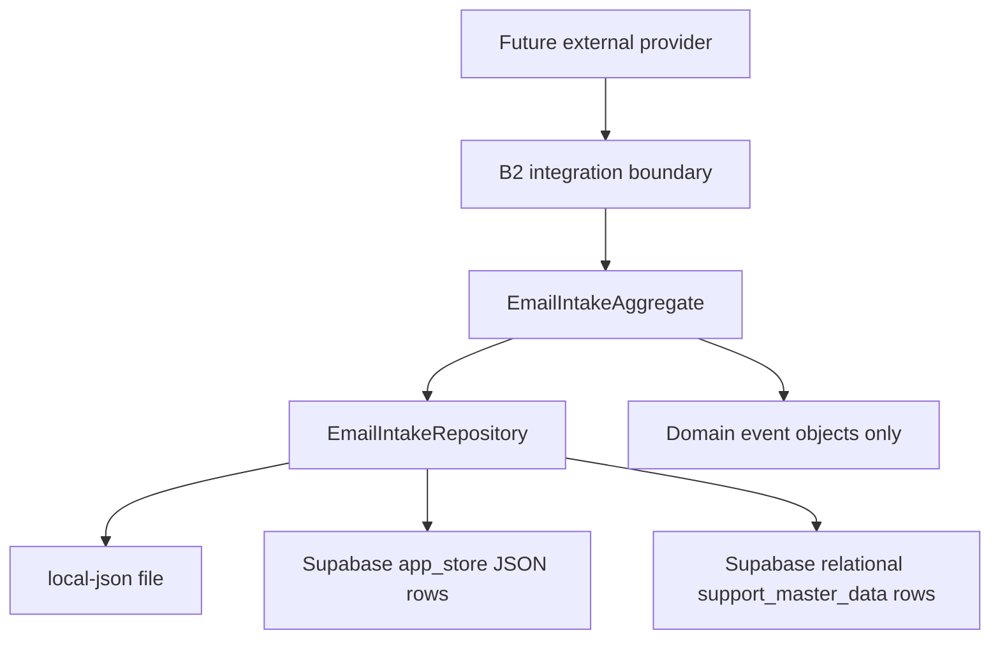
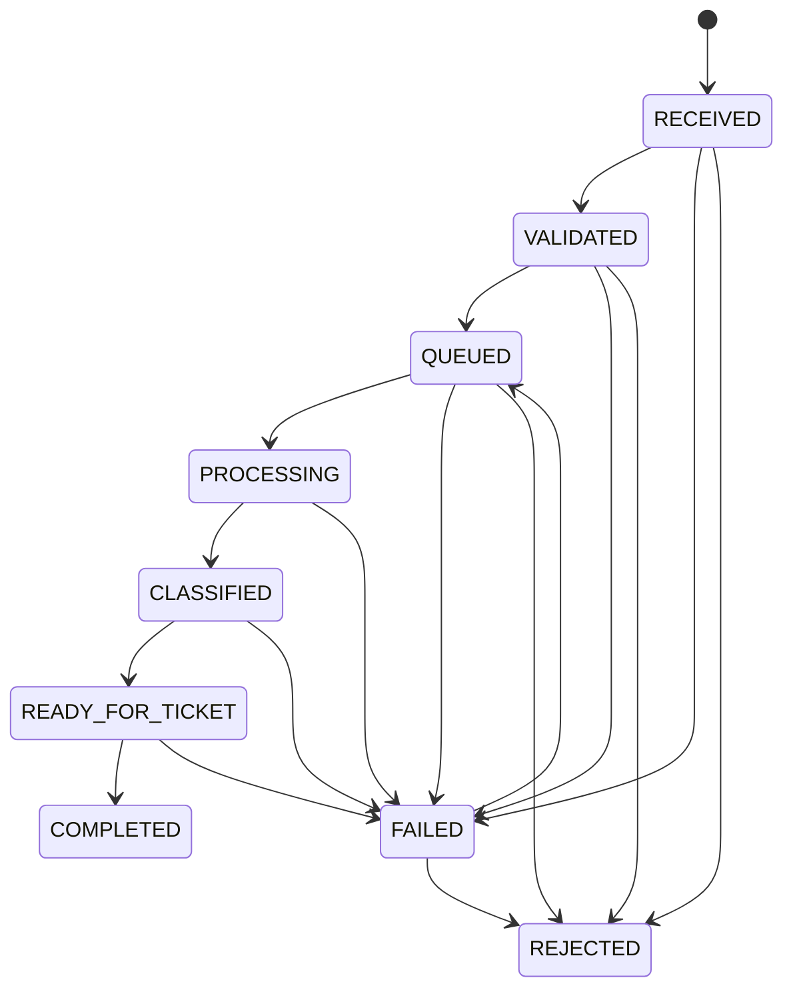

# SUPPER Email Intake Domain

Patch B3 adds the provider-neutral domain and persistence foundation between the B2 integration boundary and a future processing pipeline. It does not read mail, connect to a provider, publish events, expose an API, schedule work, or create tickets.

## Aggregate

`EmailIntakeAggregate` accepts only a B2 normalized message envelope. Creation re-derives the stable idempotency key from provider, `message.receive`, and external message ID; mismatched keys are rejected. The aggregate retains provider/correlation/external IDs, normalized addresses and bodies, attachment metadata, bounded metadata, timestamps, status, processor, retry count, and immutable audit history.

The aggregate deep-copies and freezes its private record. Every mutation returns a new aggregate plus immutable event objects. Identity fields cannot be changed by repository updates. Mutation contexts carry an actor, correlation ID, timestamp, and injected audit/event ID generators. A correlation mismatch is rejected.

Attachments remain metadata only. The model has no binary, Base64, filesystem-path, upload, or object-storage field. HTML remains untrusted opaque text; B3 does not render or sanitize it.

## Lifecycle

`COMPLETED` and `REJECTED` are terminal. Direct jumps such as `RECEIVED` to `COMPLETED` raise `InvalidStatusTransition`. Retries are recorded only while `FAILED`, use the existing B2 retry ceiling, and do not schedule work.

## Repository and storage routing

The small `EmailIntakeRepository` contract supports `create`, `update`, `exists`, `findById`, `findByExternalMessageId`, `search`, `list`, `changeStatus`, and explicitly gated `deleteForTestsOnly`. Shared repository composition owns validation, identity rules, lifecycle invocation, search, and typed errors; adapters own storage only.

The existing `DATA_BACKEND` routing is preserved:

| Backend | Storage | Duplicate guard |
| --- | --- | --- |
| `local-json` | Atomic `data/integrations/email-intakes.json` file | Serialized repository mutation and stable identity comparison |
| `supabase` | One `app_store` row per idempotency key under `integrations/email-intakes/` | Atomic primary-key insert |
| `supabase-relational` | One existing `support_master_data` row per idempotency key under `email-intake:` | Atomic primary-key insert |

No migration or schema change is required. The factory is exported from the existing repository module. Production adapters are loaded only for the selected backend; callers can inject stores for contract tests.

The Supabase JSON adapter deliberately avoids one ever-growing JSONB collection. The relational adapter reuses the existing generic master-data table because B3 forbids schema work. Both Supabase adapters paginate storage reads.

## Search

Search supports status, provider, case-insensitive sender and subject text, inclusive received-time bounds, and exact correlation ID. Results support 1-based pages, bounded page sizes, and deterministic ascending/descending sorting by received, created, or updated timestamp, subject, sender, status, or provider. Intake ID is the stable tie-breaker.

Search currently validates and filters a bounded in-memory record set after the adapter read. This is correct for the domain foundation but is not the final high-volume query model.

## Validation and idempotency

B3 composes B2 schemas instead of duplicating boundary rules. It therefore retains normalized email addresses/timestamps, recipient and attachment ceilings, bounded bodies and metadata, header allowlisting, control-character rejection, prototype-pollution defenses, and malformed identifier rejection. Persisted records are revalidated on every read.

Duplicate identity means the same intake ID, stable idempotency key, or provider plus external message ID. Because record validation requires the idempotency key derived from the external identity, the Supabase primary-key inserts also enforce external-message idempotency atomically.

## Audit and events

Audit entries are append-only inside the immutable aggregate and record creation, revision, status transition, processor assignment, and retry increment. Entries contain safe operational metadata only and must be chronological.

The domain creates versioned event objects such as `EmailIntakeCreated`, `EmailValidated`, `EmailQueued`, `EmailProcessingStarted`, `EmailClassified`, `EmailReadyForTicket`, `EmailCompleted`, `EmailFailed`, and `EmailRejected`, plus update/processor/retry events. There is no event bus, publisher, queue, worker, scheduler, retry timer, webhook, or background process.

Errors reuse `IntegrationBoundaryError`. B3 adds only `DuplicateEmailIntake`, `InvalidStatusTransition`, and `EmailIntakeNotFound`; public messages never include message content or identifiers.

`InvalidStatusTransition` retains its source and target status as non-enumerable internal context. Public and log serializers keep their existing sanitized shape and do not expose that context.

## Limitations and next work

- Relational-mode search scans `support_master_data` rows with the email-intake prefix and filters in memory. A later reviewed migration should introduce a dedicated indexed table before intake volume becomes large.
- Local JSON locking is process-local and intended for single-process development. Production should use a Supabase backend.
- There is no compare-and-swap version for concurrent updates to the same record. Atomic insert protects creation idempotency, but a future application service must define optimistic concurrency before parallel processors exist.
- B3 does not connect to IMAP, POP3, SMTP, Microsoft Graph, Outlook, ServiceNow, n8n, AI, object storage, a queue, a worker, a scheduler, a webhook, an API route, or UI.

Patch B3.5 keeps factory selection in `src/lib/email-intake/repository-factory.ts` and the application-facing factory export in `src/lib/repositories.ts`. Storage adapters and test-only adapters are intentionally not exported by the domain barrels. JSON repository contract tests use a real local JSON store rooted in a guarded OS temporary directory; relational contract tests use an isolated mock store.

## Unified Intake compatibility

AI-1.3 does not rename, delete, migrate, or dual-write existing Email Intake records. `src/lib/intake-core/email-compatibility.ts` is a pure bridge from an already validated `EmailIntake` record to a normalized intake acceptance command. It performs no persistence or network call, creates no Ticket, and enqueues no outbox command. A future migration must explicitly select records and invoke this mapper under its own reviewed idempotency and rollout policy.
