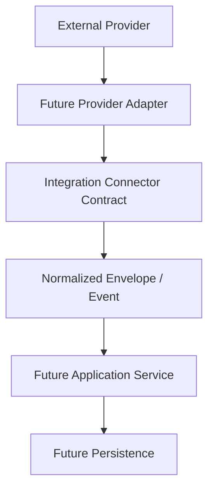

# SUPPER Integration Boundary

Patch B2 defines provider-neutral contracts for future integration work. It deliberately does not connect SUPPER to any provider, open any network connection, register an API route, start a worker, persist integration state, or change application behavior. B3 and later work must build on this boundary rather than bypass it.

## Scope and module layout

All B2 domain code is isolated under `src/lib/integrations/`:

| Module | Responsibility |
| --- | --- |
| `contracts.ts` | Provider, operation, branded ID, connector, result, and invocation contracts |
| `schemas.ts` | Zod validation, normalized envelopes, ticket references, retry metadata, and events |
| `normalization.ts` | Immutable normalization entry points and deterministic event creation |
| `idempotency.ts` | Canonical serialization and stable SHA-256 idempotency keys |
| `errors.ts` | Safe error taxonomy, internal cause retention, and explicit serializers |
| `in-memory-adapter.ts` | Small deterministic adapter for contract tests only |
| `index.ts` | Deliberate public exports |

The provider vocabulary is `email`, `n8n`, `servicenow`, and `internal`. These are identifiers only; they do not imply that a provider client exists. Operations are similarly constrained to message receipt, message normalization, ticket linking, and event handling.



Only the connector contract and normalized envelope/event layers exist in B2. Every other box is future work.

## Trust boundary

External input is untrusted until a normalization function returns successfully. Boundary schemas:

- trim and validate non-empty identifiers without silently truncating them;
- reuse the application request-ID policy for correlation IDs;
- reject control characters and CRLF injection in addresses, display names, subjects, and headers;
- lowercase email addresses and header names while preserving display text where safe;
- accept only an explicit safe header allowlist and reject authentication, cookie, and API-key headers;
- represent HTML as an opaque untrusted string; B2 does not render, sanitize, or execute it;
- represent attachments as metadata only, with no bytes, Base64, filesystem path, or upload behavior;
- normalize timestamps to ISO-8601 UTC strings;
- deep-copy and freeze normalized results so callers do not retain mutable input references;
- accept only plain, JSON-safe bounded metadata and reject prototype keys, accessors, cycles, unsupported values, and non-finite numbers.

The principal envelope limits are 100 recipients per address list, 50 attachments, 1 GiB per declared attachment size, a 500-character subject, 200,000 text-body characters, 500,000 HTML-body characters, five metadata levels, 50 keys/items per metadata container, and 16 KiB of encoded metadata. These are conservative validation ceilings: the body limits are large enough for ordinary support mail while bounding server memory, and the attachment ceiling rejects unrealistic metadata without authorizing transport or storage of attachment bytes.

The message envelope fields are: schema version, provider, operation, external message/thread IDs, correlation and idempotency IDs, inbound/outbound direction, sender, recipient/CC/BCC/reply-to addresses, optional subject, optional opaque text/HTML bodies, allowlisted headers, attachment metadata, sent/received timestamps, an optional provider locator, and bounded metadata.

An external ticket reference contains a provider, ticket ID, optional display number, optional URL, optional last-known state/sync timestamp, correlation ID, and bounded provider-neutral metadata. Ticket links require HTTPS. HTTP is accepted only for `localhost`, `127.0.0.1`, or `::1` when a caller explicitly enables the local-test option. Embedded URL credentials and other schemes are rejected.

## Events and connector contract

The versioned event union supports:

- `message.received`
- `message.normalized`
- `ticket.link.requested`
- `ticket.linked`
- `integration.failed`

Each event has schema version `1.0`, an event ID/type, provider, operation, correlation ID, optional causation ID, idempotency key, bounded attempt, normalized timestamp, bounded metadata, and a type-specific payload. Unknown event types and schema versions are rejected. Event construction receives its clock and ID generator, making behavior deterministic in tests. There is no dispatcher, queue, webhook, scheduler, event store, or background loop.

`IntegrationConnector<Input, Output>` exposes one generic asynchronous operation with an `AbortSignal` and a discriminated success/failure result. It carries no credentials and has no provider implementation. The in-memory adapter only returns preconfigured cloned results and records sanitized operational metadata; it never records input, message bodies, addresses, filenames, or customer content.

## Idempotency, retry, and errors

Canonical serialization sorts object keys and preserves array order. It treats `undefined` consistently and rejects functions, symbols, BigInt, cycles, non-finite numbers, accessors, non-plain objects, excessive depth, and excessive encoded size. Stable keys use Node SHA-256 and the format `supper:v1:<digest>`. Key material is schema-limited to provider, operation, entity kind, and a stable external message, ticket, or event ID. Bodies, passwords, tokens, and arbitrary metadata cannot enter the key helper.

Retry metadata validates bounded attempts and timestamp chronology. `canRetry()` is a pure decision only; B2 has no sleep, timer, queue, or scheduling policy.

The error taxonomy covers validation, authentication, authorization, rate limit, unavailable, timeout, conflict, duplicate, unsupported, malformed response, and internal failures. `IntegrationBoundaryError` retains an optional original cause as a non-enumerable internal property. Public and log serializers are explicit and omit causes, stacks, secrets, raw provider responses, and input content.

## Test adapter example

The in-memory connector is for tests and contract examples only. The input is deliberately never retained or logged.

```ts
import {
  deriveMessageIdempotencyKey,
} from "@/lib/integrations";
import { InMemoryIntegrationConnector } from "@/lib/integrations/in-memory-adapter";

const connector = new InMemoryIntegrationConnector<{ externalMessageId: string }, { accepted: boolean }>({
  provider: "email",
  operation: "message.receive",
  results: [{ ok: true, value: { accepted: true } }],
});

const result = await connector.execute(
  { externalMessageId: "message-42" },
  {
    correlationId,
    idempotencyKey: deriveMessageIdempotencyKey({
      provider: "email",
      operation: "message.receive",
      externalMessageId,
    }),
    attempt: 1,
  },
);
```

This example assumes that `correlationId` and `externalMessageId` were already parsed by their exported schemas.

## Extension rules for B3+

A future provider adapter must:

1. live behind the connector contract and return normalized results;
2. validate all provider input through these schemas before domain use;
3. derive idempotency keys only from the stable helper material;
4. propagate the existing correlation ID;
5. map provider failures into the safe error taxonomy without logging raw content;
6. keep credentials server-only and outside these domain contracts;
7. introduce persistence, transport, scheduling, API, and operational changes as separately reviewed work.

B3 is expected to add a separately reviewed application-service and persistence boundary, without changing these provider-neutral contracts casually. B4 may add the first real provider adapter and operational processing only after its transport, credentials, rate limits, observability, and failure behavior are explicitly reviewed.

B2 adds no environment variable, database migration, Supabase access, filesystem write, UI change, authentication change, business-logic change, or production integration. IMAP, Outlook, n8n connectivity, ServiceNow connectivity, SMTP, AI, object storage, browser storage, queues, caches, scheduled tasks, and background processing are explicitly not implemented.

## AI-1.3 extension

The additive provider vocabulary now also accepts `line`, `web`, and `freshservice`; existing provider identifiers remain unchanged. The bounded ordinary intake-channel subset is `email`, `line`, `web`, and `internal`. ServiceNow and Freshservice identify integration targets but are not customer-intake channels in AI-1.3.

Normalized intake persistence lives in the separate `src/lib/intake-core/` module described in [Unified Intake Core](unified-intake-core.md). No provider client was added. Future adapters must terminate transport authentication and signature verification before calling the strict normalized acceptance schema and atomic service-role RPC.

## AI-2.0.9 extension

The operation vocabulary now also accepts `ticket.create`, `ticket.update`, `ticket.comment`, and `ticket.work_note`. These operations are implemented only by the isolated, server-side [Controlled ServiceNow Write Kernel](servicenow-write-kernel.md); their presence does not authorize another connector to write.

The write kernel preserves the boundary rules: strict input and persisted-row schemas, signed server-issued manual operation identity, operation-scoped deterministic idempotency, server-owned provider markers, correlation IDs, bounded errors, server-only credentials, exact field allowlists, and sanitized request/response summaries. SQL independently recomputes the full semantic command hash and the separate normalized provider-payload hash. Exact provider lookup keys and one-row target pairs must match before use.

Mutation delivery certainty is part of the boundary. G1 proves one POST candidate and an exact post-write GET whose lookup and verified marker hashes both equal SQL's independent command-marker hash. G2 proves a GET-only marker recovery under the same binding. Create reconciliation requires exact GET endpoint/table, 2xx status, one match, complete target pair, and both marker hashes. Successful non-create evidence must prove exact PATCH endpoint, target pair, normalized fields, and strict 2xx response. Required proof scalars use reusable PostgreSQL validators: key presence is insufficient, and JSON null, wrong type, empty/malformed text, out-of-range integers, mismatches, or unreviewed keys are rejected with null-safe comparisons. Valid POST pairs append immutable bounded candidate events even when proof fails; they are not confirmed targets. Terminal resolution projection is queried independently from bounded display history, so nonterminal observations cannot reopen a resolved candidate. Recovery eligibility is database-owned and covers every provider request and, for OAuth, one possible token request per provider request, followed by grace. After recovery, one shared terminal-finish path rejects late success, provider errors, candidate-bearing uncertainty, and unclassified errors without another finish call or any state mutation. Verified reconciliation remains GET-only and stores only safe evidence.

The kernel adds no queue, automatic intake trigger, attachment transport, webhook, scheduler, worker, or public provider endpoint.
