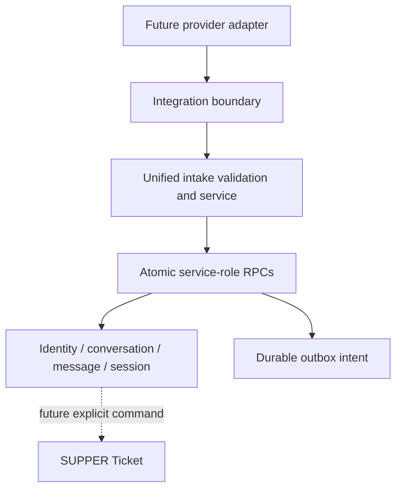

# Unified Intake Core

AI-1.3 adds a provider-neutral relational foundation for future email, LINE, web, and internal intake. It does not add a live provider adapter, public webhook, Ticket creation, ServiceNow write, attachment transfer, outbound worker, scheduler, or AI model.

## Modules

`src/lib/intake-core/` separates contracts and schemas, pure state helpers, safe presentation, repository contracts, server-only relational persistence, protected API handlers, and the guarded diagnostic. Unified writes are available only with `DATA_BACKEND=supabase-relational`; the pure domain and the existing Email Intake compatibility domain remain usable independently.

An integration provider names a broad integration (`servicenow`, `freshservice`, and others). An intake channel is the bounded customer-intake subset: `email`, `line`, `web`, or `internal`. Channel rows contain configuration identity and status, never credentials.

## Relational model

| Area | Tables |
| --- | --- |
| Channels and identity | `integration_channels`, `integration_external_identities`, `integration_identity_bindings`, `integration_identity_binding_events` |
| Intake content | `intake_conversations`, `intake_messages`, `intake_attachments`, `intake_sessions`, `intake_events` |
| Future integration | `intake_ticket_links`, `integration_outbox` |

A conversation is not a Ticket. A confirmed session means only that the user confirmed the intake data. AI-1.3 never creates a Ticket, Incident, link, or outbound command automatically.

## Event acceptance and redelivery

`support_accept_intake_event(jsonb)` validates a normalized server payload, locks by channel and external event ID, and commits the event, identity, conversation, message, attachment metadata, and optional session atomically. Exact redelivery increments `delivery_count` without duplicating records. A changed event payload or changed message content under the same external identity is rejected and rolled back. External IDs are scoped to their channel.

The internal diagnostic uses the same service and RPC twice with a stable namespace. It is exposed only to `settings:manage` users when `APP_ENV=ai-development`, `VERCEL_ENV` is not production, and the relational backend is active. It makes no network call.

## Security and data classification

| Class | Examples | Browser policy |
| --- | --- | --- |
| Public operational metadata | bounded counts and statuses | administrator operations page only |
| Internal support content | message plain text, conversation subject | bounded preview in authorized detail only |
| Customer personal data | display name and binding | authorized, minimum necessary |
| External provider identifier | external subject/conversation/message IDs | subject is server-only and masked; provider IDs are omitted from lists |
| Credentials and secrets | tokens, passwords, authorization headers | never accepted or stored in intake contracts |
| Attachment metadata | bounded filename, type, declared size, hashes/status | authorized safe metadata only |
| Attachment binary data | file bytes/Base64 | not stored in AI-1.3 |

All new tables have RLS enabled. Browser roles have no privileges. Privileged RPCs set a safe search path, revoke `PUBLIC`, `anon`, and `authenticated`, and grant only `service_role`. Raw HTML stays opaque and is never rendered. Provider locators, storage object keys, target references, raw payloads, and full external subjects are omitted from browser DTOs and general logs.

## Operations and limitations

`/settings/integrations/intake` provides Overview, Channels, Identities, Conversations, Inbound Events, Outbox, and Diagnostics using protected no-store APIs. Desktop tables have mobile cards. The outbox is durable intent only: there is no claimant, retry timer, sender, or worker. Retention dates are placeholders only; deletion and object-storage lifecycle are future reviewed work.

## Manual Preview acceptance

After an authorized operator applies `202607220001_unified_intake_core.sql` to the verified isolated `supper-ai-dev` project:

1. Deploy the exact `ai_development` commit to a Vercel Preview with `APP_ENV=ai-development`, a non-production `VERCEL_ENV`, and `DATA_BACKEND=supabase-relational`.
2. Sign in as an administrator and open **Settings -> Intake Operations**. Confirm the limitation banner and zero/safe counters; no credential fields may appear.
3. Run **Create / Replay Diagnostic Intake**. Confirm accepted then duplicate, one conversation, one message, one attachment metadata row, one collecting session, and delivery count 2.
4. Run it again. Counts must not multiply; only truthful delivery count/redelivery state changes.
5. Inspect Identities and Conversations. Identity must be masked; detail may show only plain-text preview and safe attachment/session/link metadata. Raw HTML, provider locator, object key, target references, and external subject must be absent.
6. Inspect Outbox. It must remain empty and state that no worker is active. Confirm no SUPPER Ticket or ServiceNow Incident was created.
7. Smoke-test existing ServiceNow Operations, Issue Log, login, imports, and reports.

Known limitations are intentional: no live adapter/signature verification endpoint, no invitation/account linking, no conversation mutation API, no attachment bytes/scanning, no outbox processing, no automatic Ticket/link creation, and no retention deletion job.

## Roadmap

AI-1.3 Unified Intake Core -> AI-2.0 Controlled ServiceNow Write Kernel -> AI-2.1 LINE OA Foundation and Account Linking -> AI-2.2 Guided Conversational Intake -> AI-2.3 LINE to SUPPER to ServiceNow Creation Loop.
