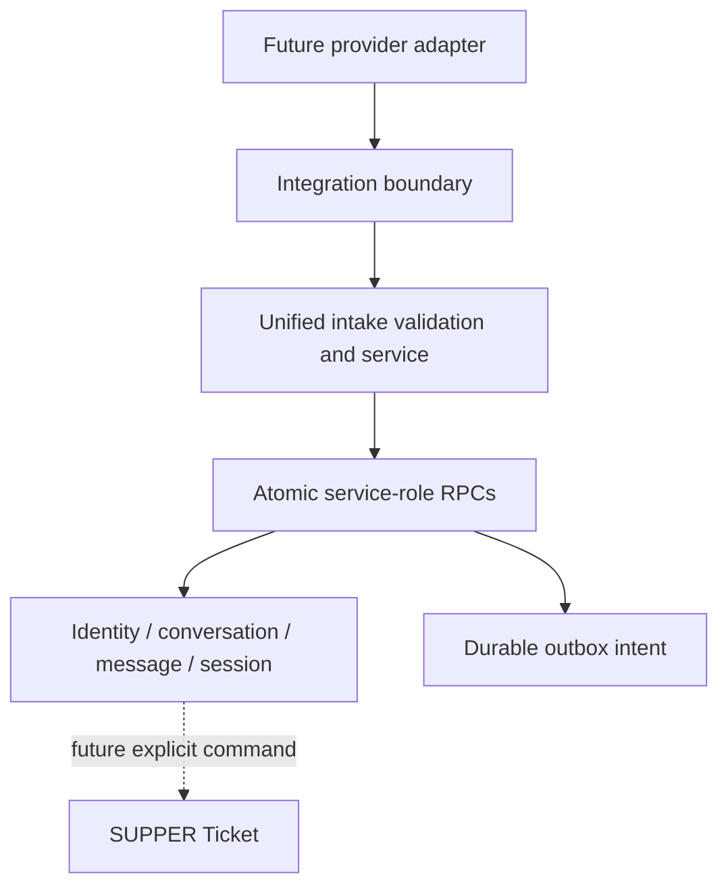

# Unified Intake Core

AI-1.3 adds a provider-neutral relational foundation for future email, LINE, web, and internal intake. It does not add a live provider adapter, public webhook, Ticket creation, ServiceNow write, attachment transfer, outbound worker, scheduler, or AI model.

## Modules

`src/lib/intake-core/` separates contracts and schemas, pure state helpers, safe presentation, repository contracts, server-only relational persistence, protected API handlers, and the guarded diagnostic. Unified writes are available only with `DATA_BACKEND=supabase-relational`; the pure domain and the existing Email Intake compatibility domain remain usable independently.

An integration provider names a broad integration (`servicenow`, `freshservice`, and others). An intake channel is the bounded customer-intake subset: `email`, `line`, `web`, or `internal`. Channel rows contain configuration identity and status, never credentials.

## Relational model

| Area | Tables |
| --- | --- |
| Channels and identity | `integration_channels`, `integration_external_identities`, `integration_identity_bindings`, `integration_identity_binding_events` |
| Intake content | `intake_conversations`, `intake_conversation_events`, `intake_messages`, `intake_attachments`, `intake_sessions`, `intake_session_events`, `intake_events`, `intake_event_deliveries` |
| Future integration | `intake_ticket_links`, `integration_outbox` |

A conversation is not a Ticket. A confirmed session means only that the user confirmed the intake data. AI-1.3 never creates a Ticket, Incident, link, or outbound command automatically.

## Event acceptance and redelivery

`support_accept_intake_event_v2(jsonb)` validates a normalized server payload and commits the event, identity, conversation, message, attachment metadata, and optional session atomically. The service derives canonical SHA-256 hashes; callers may not choose trusted hash material. SQL recomputes the same bounded material before accepting it.

Canonical JSON sorts object keys by code point, preserves array order and meaningful message whitespace, distinguishes explicit `null` from an omitted optional field, normalizes replay-significant timestamps to UTC ISO form, writes negative zero as `0`, and accepts numbers only when they are integers in JavaScript's safe range. Fractional and unsafe integers return `INTAKE_CANONICAL_NUMBER_INVALID`. The committed `canonical-vectors.json` fixture verifies identical serialization and SHA-256 output in TypeScript and PostgreSQL, including Unicode, reordered objects, bounds, negative zero, and exponent input. Message material includes channel, conversation and message identities, sender, direction, type, reply target, bodies, structured content, provider time, and deterministically sorted immutable attachment source hashes. Event material additionally includes the external event/type, identity, conversation, requested session initialization, and attachment hashes. Local receipt time, request/correlation IDs, and mutable attachment lifecycle state are intentionally excluded.

Exact event redelivery keeps `processing_status=accepted`, sets `redelivery=true`, and increments lifetime counters; it also appends one metadata-only row to `intake_event_deliveries`. Operations 24-hour accepted, duplicate, and failed metrics use this chronological ledger rather than lifetime counters, so an old duplicate is not attributed to a recent delivery. Ledger rows contain identifiers, sequence, type, timestamps, and bounded correlation metadata only, never payloads, message bodies, external subjects, or credentials. Same-ID changed material returns a bounded replay conflict and rolls the transaction back. An exact message replay reuses its original identity and conversation and creates no content or session rows. A conflicting message conversation, sender, direction, type, reply target, content, provider time, or attachment returns `INTAKE_MESSAGE_REPLAY_MISMATCH`. Ordinary message activity never reopens a closed or archived conversation.

Concurrency is scoped to `(channel, external event)`, message, conversation, subject, and attachment identities using transaction advisory locks plus row locks only for touched records. The enabled-channel lookup is not locked, so unrelated events in one channel can proceed concurrently.

The internal diagnostic uses the same service and RPC twice with a stable namespace. It is exposed only to `settings:manage` users when `APP_ENV=ai-development`, `VERCEL_ENV` is not production, and the relational backend is active. It makes no network call.

## Security and data classification

| Class | Examples | Browser policy |
| --- | --- | --- |
| Public operational metadata | bounded counts and statuses | administrator operations page only |
| Internal support content | message plain text, conversation subject | bounded preview in authorized detail only |
| Customer personal data | display name and binding | authorized, minimum necessary |
| External provider identifier | external subject/conversation/message IDs | subject is server-only and masked; provider IDs are omitted from lists |
| Credentials and secrets | tokens, passwords, authorization headers | never accepted or stored in intake contracts |
| Attachment metadata | bounded filename, type, declared size, hashes/status | authorized safe metadata only |
| Attachment binary data | file bytes/Base64 | not stored in AI-1.3 |

All new tables have RLS enabled. Browser roles have no privileges. Privileged RPCs set a safe search path, revoke `PUBLIC`, `anon`, and `authenticated`, and grant only `service_role`. Raw HTML stays opaque and is never rendered. Provider locators, storage object keys, target references, raw payloads, and full external subjects are omitted from browser DTOs and general logs.

One recursive sensitive-key policy is enforced in TypeScript and SQL. Keys are split across camel/Pascal case, normalized across separators, lowercased, and also compacted to ASCII alphanumerics before classification. This closes separator-free forms such as `clientsecret`, `xapikey`, `accesstoken`, `signeddownloadurl`, and `supabaseservicerolekey` while explicit whole-concept matching avoids rejecting safe words such as `tokenizer`, `secretariat`, `monkey`, and `keyboard`. Credential-bearing input returns `INTAKE_SENSITIVE_DATA_REJECTED`. Non-ASCII and control-character key tricks, prototype keys, cycles, accessors, raw provider payloads, and nested occurrences in arrays are rejected. Metadata uses strict per-record allowlists for channels, events, identities, conversations, messages, attachments, sessions, bindings, and outbox commands; unknown keys are invalid.

Public errors come from an explicit catalogue. Validation is `400`/`422`, missing records `404`, replay/version/idempotency conflicts `409`, a missing relational backend `503`, and unknown storage failures `500`. SQL details, relation names, provider identifiers, and message content are never used as public messages.

## Operations and limitations

`/settings/integrations/intake` provides Overview, Channels, Identities, Conversations, Inbound Events, Outbox, and Diagnostics using protected no-store APIs. Identity/conversation/event counts are aggregated by bounded SQL read-model RPCs. Message and attachment detail are independently paginated, deterministically ordered, capped at 100, and return separate `hasNext` values. Conversation links are bounded. Channel filters accept ordinary intake providers only; outbox filters accept every integration target provider. Desktop tables have mobile cards. The outbox is durable intent only: there is no claimant, retry timer, sender, or worker. Retention dates are placeholders only; deletion and object-storage lifecycle are future reviewed work.

Conversation status changes use `support_transition_intake_conversation_v2(jsonb)` with compare-and-swap `expectedVersion`; closed-to-open requires explicit reopen and archived is terminal. A current-version request whose target already equals the persisted status returns `action=unchanged` without incrementing the version, changing timestamps, or appending history. Stale same-state requests still conflict. Every real change and intake activity appends `intake_conversation_events` atomically. Session changes likewise append bounded `intake_session_events` in the same transaction. History stores actors, request/correlation IDs, versions, status, and changed-field names only, never message bodies or full state. Confirming a session creates neither a Ticket nor an outbox command.

## Manual Preview acceptance

After an authorized operator applies migrations in order through `202607220003_unified_intake_core_replay_corrections.sql` to the verified isolated `supper-ai-dev` project:

1. Deploy the exact `ai_development` commit to a Vercel Preview with `APP_ENV=ai-development`, a non-production `VERCEL_ENV`, and `DATA_BACKEND=supabase-relational`.
2. Sign in as an administrator and open **Settings -> Intake Operations**. Confirm the limitation banner and zero/safe counters; no credential fields may appear.
3. Run **Create / Replay Diagnostic Intake**. Confirm accepted then duplicate, one conversation, one message, one attachment metadata row, one collecting session, delivery count 2, duplicate delivery count 1, two chronological ledger rows, and accepted status retained.
4. Run it again. Content counts must not multiply; only lifetime counters and one new duplicate-delivery ledger row may change. The 24-hour duplicate metric must match ledger rows inside the actual window.
5. Inspect Identities and Conversations. Identity must be masked; detail may show only plain-text preview and safe attachment/session/link metadata. Raw HTML, provider locator, object key, target references, and external subject must be absent.
6. Inspect Outbox. It must remain empty and state that no worker is active. Confirm no SUPPER Ticket or ServiceNow Incident was created.
7. Smoke-test existing ServiceNow Operations, Issue Log, login, imports, and reports.

Known limitations are intentional: no live adapter/signature verification endpoint, no invitation/account linking, no browser conversation mutation route, no attachment bytes/scanning, no outbox processing, no automatic Ticket/link creation, and no retention deletion job.

## Roadmap

AI-1.3 Unified Intake Core -> AI-2.0 Controlled ServiceNow Write Kernel -> AI-2.1 LINE OA Foundation and Account Linking -> AI-2.2 Guided Conversational Intake -> AI-2.3 LINE to SUPPER to ServiceNow Creation Loop.
